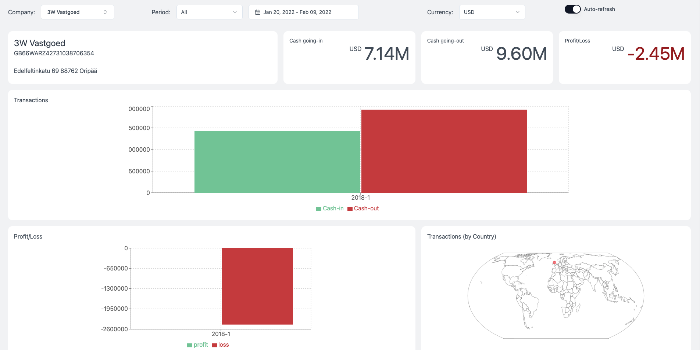
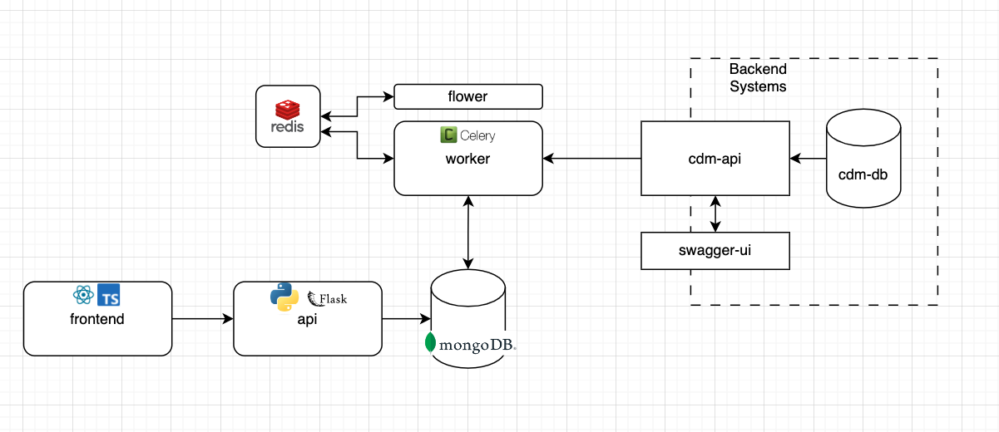

## Cash Flow Dashboard - ING Technical Case

### Overview

This application will help end-users to analyze their Cash Flow based on transaction records.

There are 4 main components:
- Frontend App that shows the Cash Flow Dashboard
- API that queries data from MongoDB
- MongoDB where transformed data are stored and does data aggregations
- Background Worker, manages the scheduled tasks to query the System APIs and transform the data to be stored in MongoDB

### Tech Stack
- Background Worker
  -  Python, 
  -  Celery as task queue system
  -  Flower for visualization of task queue
  -  Redis as Celery broker
  -  MongoDB as data storage
- API 
  - Python, 
  - Flask as API Web Server
  - MongoDB for data aggregations
- Frontend 
  - React, 
  - Typescript,
  - TailwindCSS for styling
  - [@shacdn/ui](https://ui.shadcn.com) for re-usable UI components
  - [recharts](recharts.org) for Charts
  - [react-simple-maps](https://www.react-simple-maps.io) for World Map visualization

### Local Development Setup
- From root directory, run `docker-compose build` - this will take some time.
- Run `docker-compose up`
- The applications should be available at:
  - Frontend: http://localhost:3000
  - API: http://localhost:7777
  - Flower (Celery UI): http://localhost:5555
- For Front-end local development, comment-out the frontend block in docker-compose.yaml and install the dependencies using `cd frontend && npm i` r
- Run the frontend app using `npm run start` 
- For API development, run in `docker-compose up -d` detached mode. 
- For any changes in the API code, restart the service by `docker-compose restart api`
- To view logs `docker-compose logs <service-name> -f`
- To stop particular services, example the worker, `docker-compose stop worker`
- Note: dont use `docker-compose down` as this will clear the DB volumes and will lose the already processed data. Do `docker-compose stop` instead
  